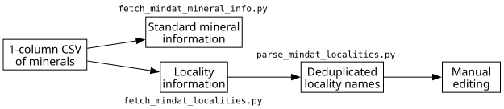

# Mindat API access scripts

By Sarah Stewart, University of Edinburgh, April-June 2026.

Contact: s.v.stewart@ed.ac.uk 

Scripts used to automate the querying and retrieval of information from Mindat.org via the API.
The scripts were originally created to search for Scottish localities, but can be easily modified for other localities. See the individual help pages for information on this.

The main aims of these scripts are to:
- match a mineral list to standardised Mindat mineral records
- retrieve general mineral information such as formula and classification
- retrieve occurrence and locality information
- reorganise Mindat locality strings into more structured location fields
- produce a deduplicated list of localities for later matching and manual review

These scripts are intended to be run in sequence.

---

## Scripts included

### [mindat_api.py](how-to/mindat-api-helper.md)
Shared helper used by other scripts to retrieve info from Mindat.

### [fetch_mindat_mineral_info.py](how-to/fetch-mindat-mineral-info.md)
Fetches general mineral information from Mindat for a list of mineral names.

### [fetch_mindat_localities.py](how-to/fetch-mindat-localities.md)
Retrieves occurrence and locality information from Mindat for the input minerals.

### [parse_mindat_localities.py](how-to/parse-mindat-localities.md)
Splits Mindat free-text locality strings into structured fields and creates a deduplicated locality list.

---

## Recommended workflow

---

## Script outputs

The output names are based on a Scottish locality search.

| File | Description |
| :--- | :--- |
| `Scotland_minerals.csv` | Clean Mindat mineral reference table with IDs, formulae, and classifications. |
| `Scotland_minerals_rarity_summary.csv` | Scottish occurrence summary for the input minerals. |
| `Scotland_minerals_localities.csv` | Scottish mineral-locality output from Mindat. |
| `Scotland_minerals_localities_separated.csv` | Parsed version of the Mindat locality table with structured place fields. |
| `mindat_unique_locations.csv` | Deduplicated list of Mindat localities for later review and matching. |

--

## License

These materials are made freely available, and are licensed under a [CC-BY 4.0](https://creativecommons.org/licenses/by/4.0/) license.
